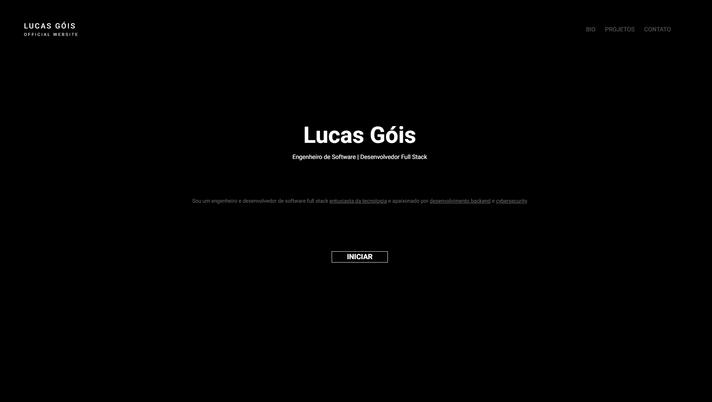

# Portfólio - Lucas Góis



Um site de portfólio pessoal criado para apresentar minha jornada como desenvolvedor, destacando conhecimentos técnicos, projetos realizados e experiência profissional.

## 🚀 Acesso ao Site

O portfólio está disponível em: [https://zlucasftw.github.io/portfolio/](https://zlucasftw.github.io/portfolio_html_css/)

## 💻 Tecnologias e Recursos Implementados

- [x] Estruturação com HTML5 semântico para melhor organização do conteúdo
- [x] Estilização personalizada com CSS3 refletindo identidade visual própria
- [x] Interatividade básica com JavaScript para navegação fluida
- [x] Versionamento completo com Git e código hospedado no GitHub
- [x] Publicação online via GitHub Pages para fácil acesso
- [x] Design responsivo adaptado para mobile, tablet e desktop
- [x] Seção de apresentação pessoal com foto e descrição
- [x] Área dedicada à exibição de projetos com links funcionais
- [x] Demonstração visual de habilidades técnicas com ícones
- [x] Formulário de contato e links para redes sociais

## 🛠️ Instalação Local

Para visualizar o projeto em sua máquina:

1. Clone este repositório:
```bash
git clone https://github.com/zlucasftw/portfolio_html_css.git
```

2. Navegue até o diretório do projeto:
```bash
cd portfolio_html_css
```

3. Abra qualquer arquivo HTML no seu navegador:
```bash
open index.html
```

## 📂 Organização do Código

O projeto está estruturado de forma modular:

```
├── index.html          # Página inicial com apresentação
├── bio.html            # Informações biográficas
├── projects.html       # Vitrine de projetos realizados
├── contact.html        # Formulário de contato
├── css/                # Estilos separados por componente
├── script.js           # Funcionalidades interativas
└── assets/             # Recursos visuais e mídia
```

## 🔮 Evolução

- [ ] Migração para framework moderno (Next.js ou React)
- [ ] Implementação de sistema de temas claro/escuro
- [ ] Criação de seção de blog para artigos técnicos
- [ ] Adição de efeitos visuais avançados com GSAP ou Framer Motion
- [ ] Implementação de recursos de acessibilidade avançados
- [ ] Suporte a múltiplos idiomas
- [ ] Backend para gestão dinâmica de conteúdo
- [ ] Otimização de performance e SEO avançado

## 🤝 Créditos e inspirações

- [Silent Poets](https://www.silentpoets.net/)
- [Nathan Brodin](https://brodin.dev/)
- [Rocketseat](https://www.figma.com/@rocketseat)

## 📝 Licença

© Lucas Góis | Todos os direitos reservados.

Este projeto está licenciado sob a Licença MIT. Veja o arquivo [LICENSE](LICENSE) para mais detalhes.
